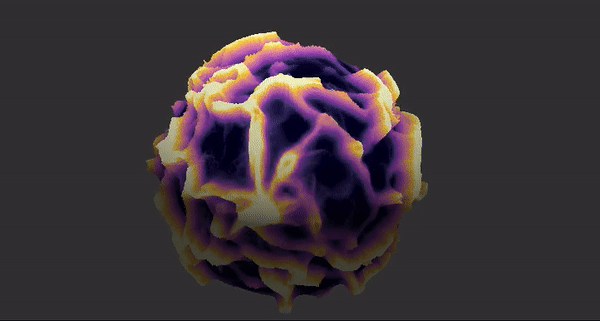

# PhysariumCubeMap
Physarium on CubeMap using CUDA for simulation

Following dependencies are required for build:
-----
* [BGFX](https://github.com/bkaradzic/bgfx)
* [Dear ImGui](https://github.com/ocornut/imgui)
* CUDA
